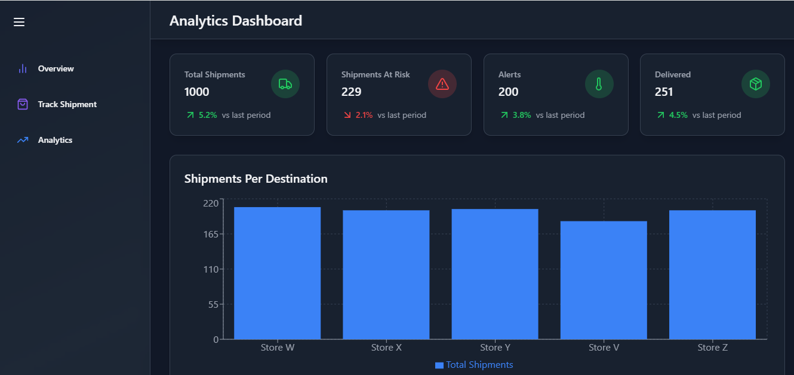
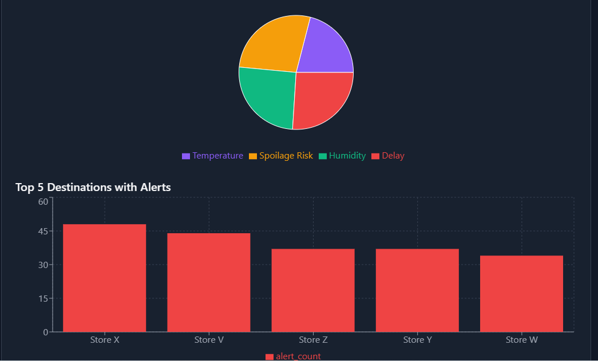

Project Abstract:

This project is about building a smart system to track shipment of farm fresh products effectively to store , prevent spoilage and reduce wastage. This helps the eco system to keep food fresh, lower carbon emissions and ensure surplus food goes to food banks instead of resulting in wastage.

Technology Used

-Nodejs for backend : Nodejs sends the API request to the back end database and connects with the Python in backend to facilitate the display of shipment , alerts, delivery status, route status and the like.
-Python for backend : Python connects to the back end database , triggers the query thereby fetching data from back end DB and passes it to the front end application to display the data.
-React js for front end : This facilitates the Graphical User Interface for the front end .
-Database: The database is deployed in the MY SQL Workbench 8.0 . This is where the shipment records, alerts for spoilage , farm location, store locations are all stored.

Screen Shots :

Analytics paging showing the product analysis 
  //Ctrl+click and it will display the page

Shipment Alerts

This page shows the status on shipments ,alerts if any, those at risk , average temparature and humidity of storage and related details. 
